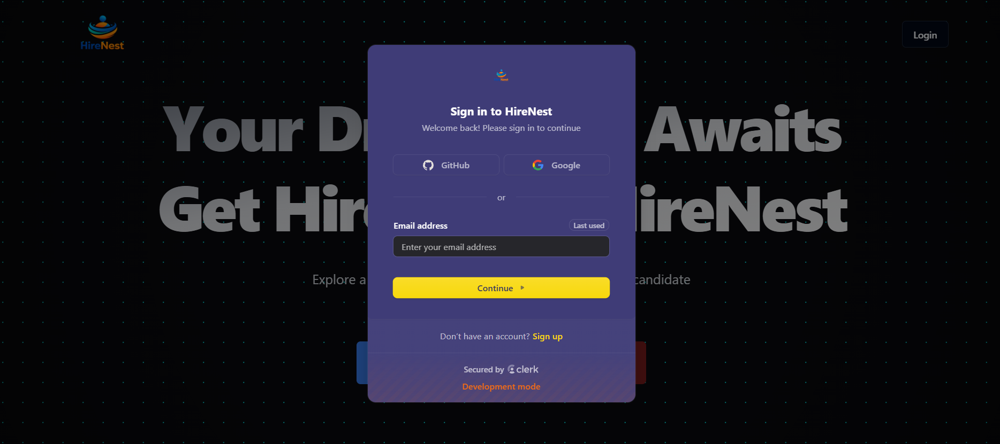
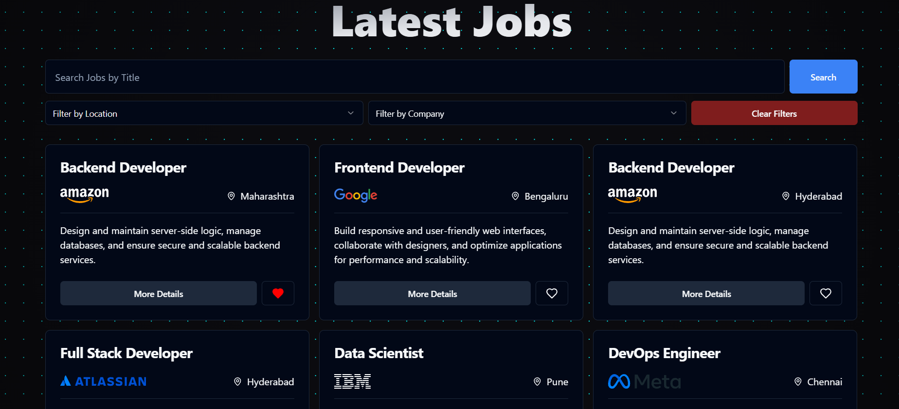
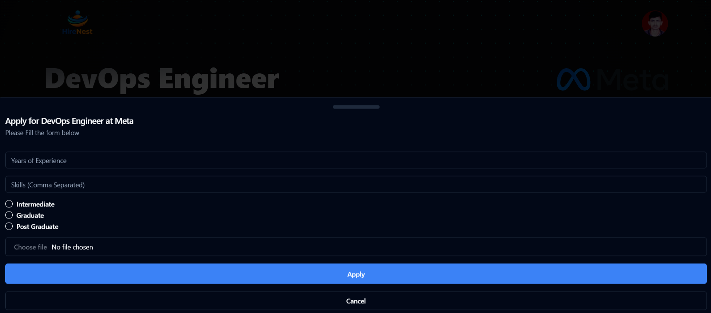

# HireNest 🚀

HireNest is a modern **full‑stack job portal** that connects **candidates** and **recruiters** on a single, clean platform. It is built with a fast, scalable, and developer‑friendly tech stack, focusing on great UX, secure authentication, and real‑time data handling.

---

## 📸 Screenshots

## 🔐 Authentication

<p align="center">
  
</p>

## 🏠 Landing Page

<p align="center">
  
</p>

## Job Listings Page

<p align="center">
  
</p>

## View Job Details

<p align="center">
  
</p>

## Apply for Job

<p align="center">
  
</p>

## 📢 Recruiter Dashboard

<p align="center">
  
</p>

---

## ✨ Features

### 👤 For Candidates

- Secure authentication and onboarding
- Create and manage candidate profiles
- Browse and search job listings
- Apply for jobs seamlessly
- Track application status

### 🧑‍💼 For Recruiters

- Recruiter authentication and dashboard
- Create, update, and delete job postings
- View applicants for each job
- Manage hiring workflow efficiently

### 🔐 Authentication & Security

- Role‑based authentication (Candidate / Recruiter)
- Secure session management using **Clerk**

### ⚡ Platform Highlights

- Fully responsive UI
- Clean, modern design with **Tailwind CSS** & **shadcn/ui**
- Real‑time database interactions via **Supabase**
- Scalable architecture suitable for production

---

## 🛠 Tech Stack

### Frontend

- **React.js** – UI development
- **Tailwind CSS** – Utility‑first styling
- **shadcn/ui** – Accessible, modern UI components

### Backend & Services

- **Supabase** – Database, storage, and backend services
- **Clerk** – Authentication and user management

---

## ⚙️ Installation & Setup

### Prerequisites

- Node.js (v18+ recommended)
- npm or yarn

### 1️⃣ Clone the Repository

```bash
git clone https://github.com/your-username/hirenest.git
cd job-portal
```

### 2️⃣ Install Dependencies

```bash
npm install
# or
yarn install
```

### 3️⃣ Environment Variables

Create a `.env` file in the root directory and add:

```env
VITE_SUPABASE_URL=your_supabase_url
VITE_SUPABASE_ANON_KEY=your_supabase_anon_key
VITE_CLERK_PUBLISHABLE_KEY=your_clerk_publishable_key
```

### 4️⃣ Run the Development Server

```bash
npm run dev
# or
yarn dev
```

The app will be available at `http://localhost:5173`.

---

## 🗄 Database Schema (Supabase)

- **jobs** – Job postings
- **applications** – Job applications and statuses
- **saved_jobs** – Jobs bookmarked by candidates
- **companies** – Recruiter company profiles
- **resumes** – Uploaded candidate resumes

_(Schema can be extended based on future requirements)_

---

## 🌱 Future Enhancements

- Advanced job filtering & recommendations
- Notifications for job updates
- Admin dashboard
- Analytics for recruiters
- AI-based resume analysis
- Enhanced candidate-recruiter messaging system

---

## 🤝 Contributing

Contributions are welcome!

1. Fork the repository
2. Create a new branch
3. Commit your changes
4. Push to the branch
5. Open a Pull Request

---

## 📄 License

This project is licensed under the **MIT License**.

---

## 🙌 Acknowledgements

- [React](https://react.dev)
- [Tailwind CSS](https://tailwindcss.com)
- [shadcn/ui](https://ui.shadcn.com)
- [Supabase](https://supabase.com)
- [Clerk](https://clerk.dev)

---

## 🌐 Live Demo

>

---

### ⭐ If you like this project, consider giving it a star!

Happy coding 💙